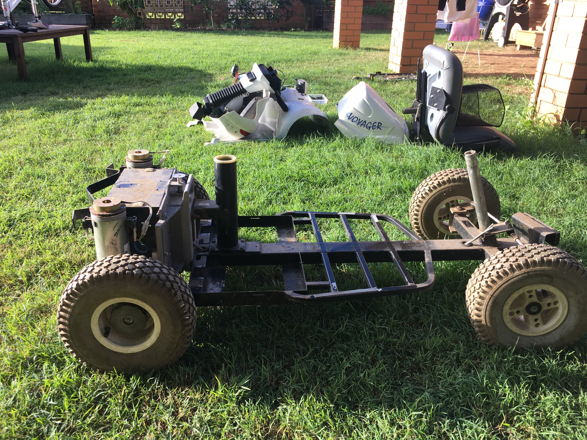

# Clean up the frame

{:class="img-responsive"}

# Remove any excess metal parts

You are now at the point where you should remove any excess metal parts, burrs and rust. 

Start out with an angle grinder with a cutoff wheel and remove any larger metal parts. Clean up rust, burrs and excess wilds with an angle grinder with a grinding disk. If you do not wish to use an angle grinder, you can use hand tools but it will take much longer.

See image at top which shows all excess metal removed